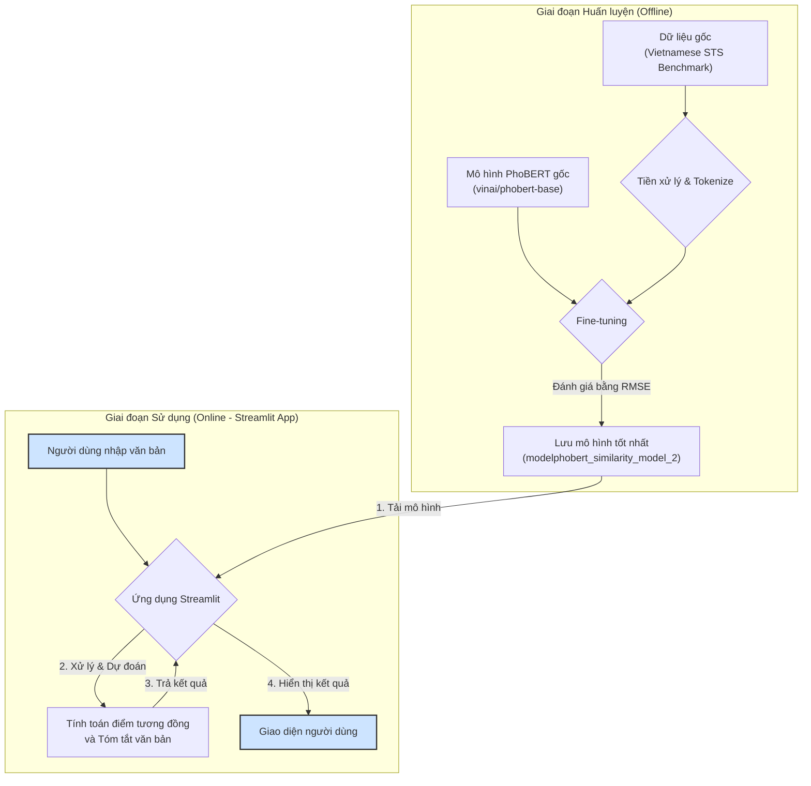
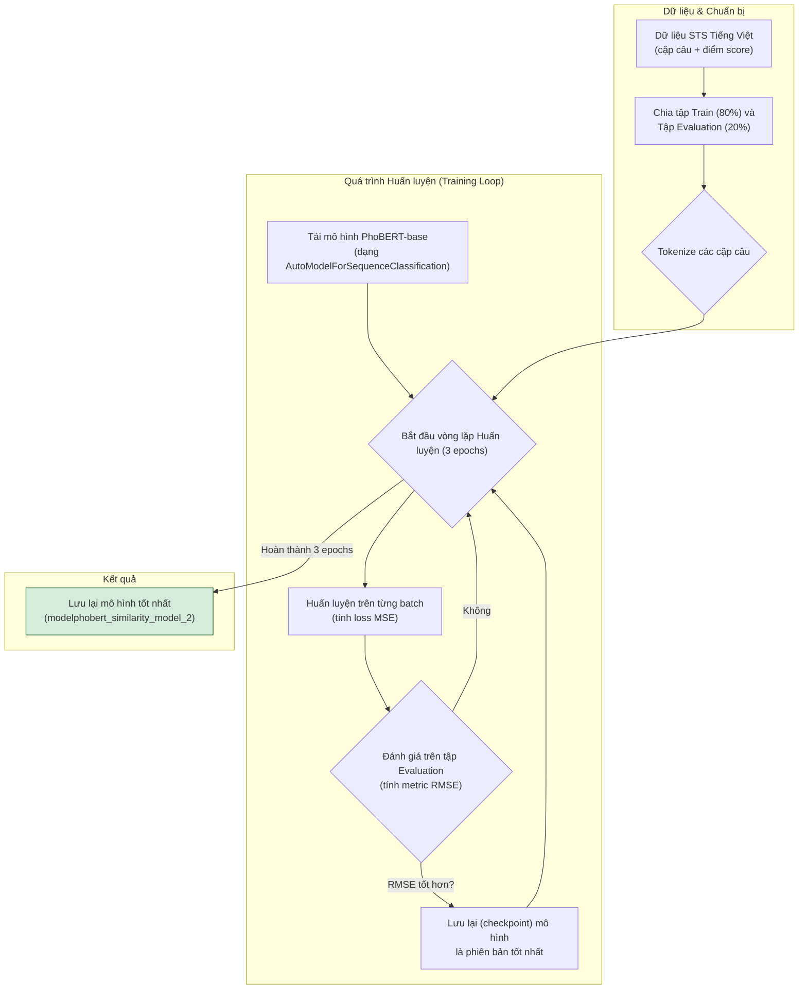
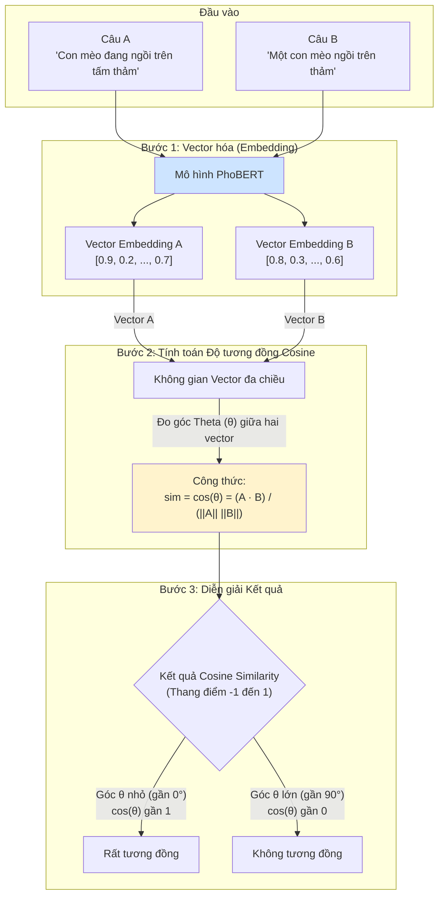

# Quy trình hoạt động của dự án Phân tích Tương đồng Ngữ nghĩa

Tài liệu này mô tả chi tiết các luồng hoạt động chính trong dự án, từ giai đoạn huấn luyện mô hình cho đến khi người dùng cuối sử dụng ứng dụng.

---

## 1. Sơ đồ hoạt động tổng quan

Sơ đồ dưới đây minh họa luồng hoạt động tổng thể của dự án, phân chia rõ ràng giữa hai giai đoạn chính: huấn luyện mô hình (offline) và sử dụng ứng dụng (online).

# Quy trình hoạt động của dự án Phân tích Tương đồng Ngữ nghĩa

Tài liệu này mô tả chi tiết các luồng hoạt động chính trong dự án, từ giai đoạn huấn luyện mô hình cho đến khi người dùng cuối sử dụng ứng dụng.

---

## 1. Sơ đồ hoạt động tổng quan

Sơ đồ dưới đây minh họa luồng hoạt động tổng thể của dự án, phân chia rõ ràng giữa hai giai đoạn chính: huấn luyện mô hình (offline) và sử dụng ứng dụng (online).

---

## 2. Chi tiết quá trình Huấn luyện Mô hình (Fine-tuning)

Đây là quy trình chi tiết bên trong giai đoạn huấn luyện. Mục tiêu là dạy cho mô hình `PhoBERT` cách đưa ra một điểm số chính xác để đánh giá sự tương đồng giữa hai câu.

**Diễn giải các bước:**
1.  **Chuẩn bị dữ liệu**: Dữ liệu được chia thành hai phần, một để huấn luyện (`train`) và một để đánh giá (`evaluation`) hiệu năng của mô hình sau mỗi chu kỳ.
2.  **Tokenize**: Các câu văn được chuyển đổi thành định dạng số mà mô hình có thể hiểu được.
3.  **Vòng lặp huấn luyện**:
    *   Mô hình học từ dữ liệu trong tập `train`.
    *   Sau mỗi `epoch` (một lượt học qua toàn bộ dữ liệu), mô hình được đánh giá trên tập `evaluation` bằng chỉ số **RMSE (Root Mean Square Error)**.
    *   Nếu mô hình ở `epoch` hiện tại có kết quả tốt hơn (RMSE thấp hơn) so với trước đó, phiên bản này sẽ được lưu lại.
4.  **Kết quả**: Sau khi hoàn tất, mô hình tốt nhất đã được lưu sẽ được sử dụng cho ứng dụng.

---

## 3. Nguyên lý hoạt động của Cosine Similarity

`Cosine Similarity` là một trong những phương pháp nền tảng để đo lường sự tương đồng về ngữ nghĩa. Mặc dù ứng dụng chính (`vn_app.py`) sử dụng mô hình hồi quy đã được huấn luyện để đưa ra điểm số trực tiếp, phiên bản `semantic_similarity_analysis.py` và nguyên lý cốt lõi của mô hình đều dựa trên khái niệm này: **các câu có ngữ nghĩa giống nhau sẽ có các vector biểu diễn nằm gần nhau trong không gian vector.**

Sơ đồ dưới đây giải thích cách hoạt động của phương pháp này.

**Diễn giải các bước:**
1.  **Vector hóa**: Mỗi câu được mô hình ngôn ngữ (ở đây là PhoBERT) chuyển đổi thành một vector số, đại diện cho ý nghĩa của nó.
2.  **Tính toán**: Thay vì đo khoảng cách thông thường, phương pháp này đo **góc (theta - θ)** giữa hai vector.
3.  **Kết quả**:
    *   Nếu góc **θ** nhỏ (hai vector gần như trùng hướng), ý nghĩa của chúng rất giống nhau và điểm tương đồng tiến tới **1**.
    *   Nếu góc **θ** gần 90° (hai vector gần như vuông góc), chúng không có nhiều liên quan về mặt ngữ nghĩa và điểm tương đồng tiến tới **0**.

---

## 2. Chi tiết quá trình Huấn luyện Mô hình (Fine-tuning)

Đây là quy trình chi tiết bên trong giai đoạn huấn luyện. Mục tiêu là dạy cho mô hình `PhoBERT` cách đưa ra một điểm số chính xác để đánh giá sự tương đồng giữa hai câu.

**Diễn giải các bước:**
1.  **Chuẩn bị dữ liệu**: Dữ liệu được chia thành hai phần, một để huấn luyện (`train`) và một để đánh giá (`evaluation`) hiệu năng của mô hình sau mỗi chu kỳ.
2.  **Tokenize**: Các câu văn được chuyển đổi thành định dạng số mà mô hình có thể hiểu được.
3.  **Vòng lặp huấn luyện**:
    *   Mô hình học từ dữ liệu trong tập `train`.
    *   Sau mỗi `epoch` (một lượt học qua toàn bộ dữ liệu), mô hình được đánh giá trên tập `evaluation` bằng chỉ số **RMSE (Root Mean Square Error)**.
    *   Nếu mô hình ở `epoch` hiện tại có kết quả tốt hơn (RMSE thấp hơn) so với trước đó, phiên bản này sẽ được lưu lại.
4.  **Kết quả**: Sau khi hoàn tất, mô hình tốt nhất đã được lưu sẽ được sử dụng cho ứng dụng.

---

## 3. Nguyên lý hoạt động của Cosine Similarity

`Cosine Similarity` là một trong những phương pháp nền tảng để đo lường sự tương đồng về ngữ nghĩa. Mặc dù ứng dụng chính (`vn_app.py`) sử dụng mô hình hồi quy đã được huấn luyện để đưa ra điểm số trực tiếp, phiên bản `semantic_similarity_analysis.py` và nguyên lý cốt lõi của mô hình đều dựa trên khái niệm này: **các câu có ngữ nghĩa giống nhau sẽ có các vector biểu diễn nằm gần nhau trong không gian vector.**

Sơ đồ dưới đây giải thích cách hoạt động của phương pháp này.

**Diễn giải các bước:**
1.  **Vector hóa**: Mỗi câu được mô hình ngôn ngữ (ở đây là PhoBERT) chuyển đổi thành một vector số, đại diện cho ý nghĩa của nó.
2.  **Tính toán**: Thay vì đo khoảng cách thông thường, phương pháp này đo **góc (theta - θ)** giữa hai vector.
3.  **Kết quả**:
    *   Nếu góc **θ** nhỏ (hai vector gần như trùng hướng), ý nghĩa của chúng rất giống nhau và điểm tương đồng tiến tới **1**.
    *   Nếu góc **θ** gần 90° (hai vector gần như vuông góc), chúng không có nhiều liên quan về mặt ngữ nghĩa và điểm tương đồng tiến tới **0**. 
